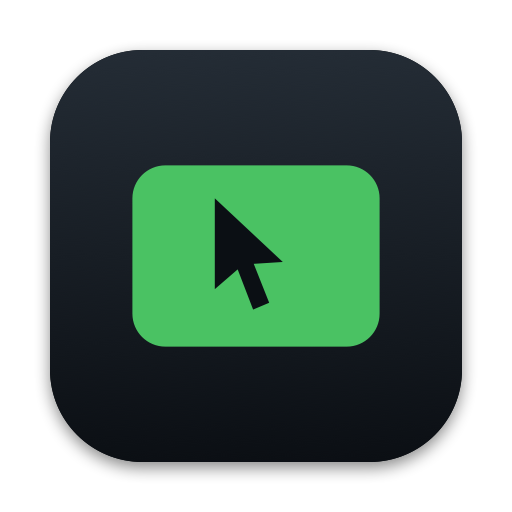
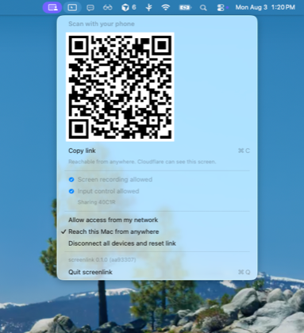
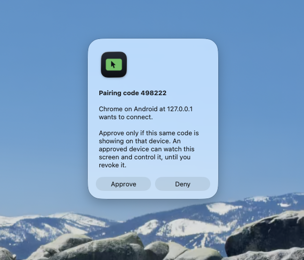
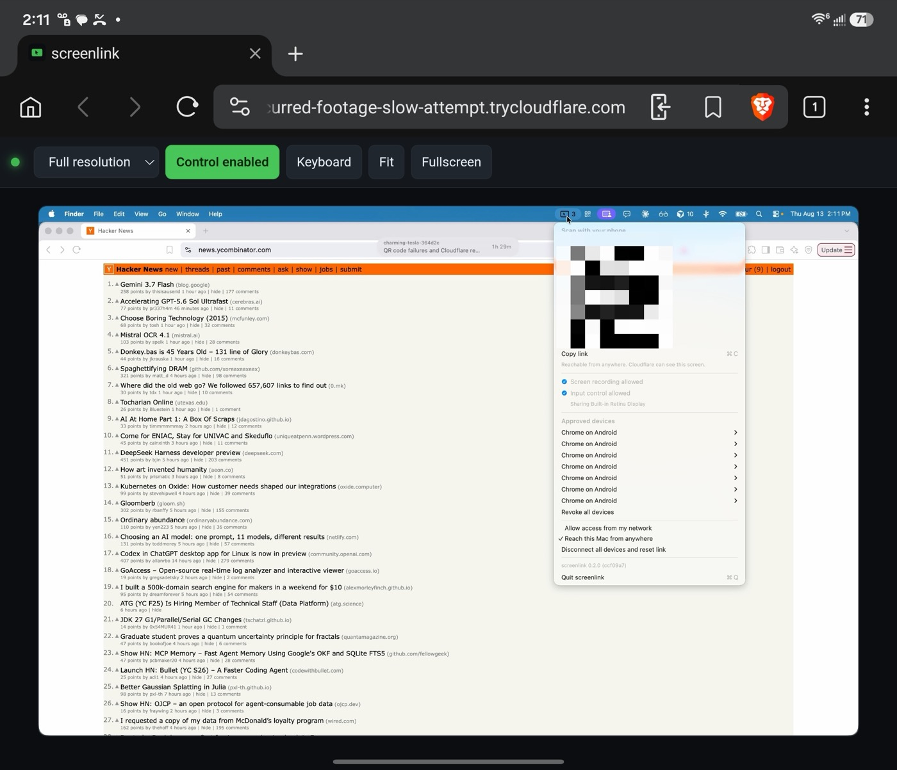
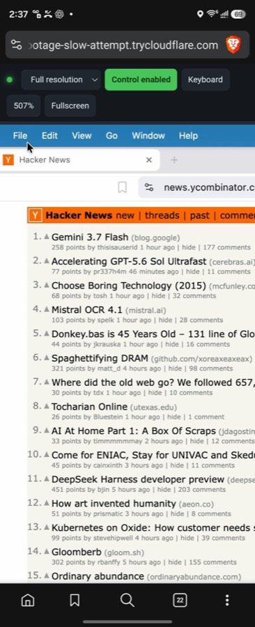

<div align="center">



# screenlink

**Watch and control your Mac from your phone. From anywhere.**

[](https://github.com/dsalehipour/Screen-Link/releases/latest) [](#requirements) [](#why-it-is-fast) [](#measured)

<a href="https://github.com/dsalehipour/Screen-Link/releases/latest/download/screenlink.zip"></a>

<sub>566 KB · Apple Silicon · macOS 14 or later · always the newest build · <a href="https://github.com/dsalehipour/Screen-Link/releases/latest">release notes</a> · <a href="#connect-your-phone">two-minute setup</a></sub>

</div>

A native Swift app captures the screen with ScreenCaptureKit, encodes it on the hardware H.264 engine,
and streams it to a web page over a WebSocket. The page sends mouse and keyboard events back, which
are injected as real system events. About 17 ms from capture to the browser's decoder at the default
1920 px, 56 fps, measured over a Cloudflare tunnel — see [Measured](#measured).

Two consumers on one core:

- **Human** — low-latency H.264 video stream decoded in the browser with WebCodecs.
- **Agent** — `GET /screenshot` for a JPEG and `POST /command` for input, no video pipeline involved.

## Connect your phone

One download, two permission toggles, one QR code. Nothing to install on the phone, no account, no
port forwarding, no configuration file. You need an Apple Silicon Mac on macOS 14 or later; the full
list is under [Requirements](#requirements).

Click **Reach this Mac from anywhere**, scan the code with your phone, and approve the device when the
Mac asks. That is the entire setup, and all of it happens while you are stood at the computer — from
then on you can walk away and watch and control this Mac from your phone, from anywhere in the world.

<p align="center">

&nbsp;

</p>

Approve it, and that is the Mac — the whole screen, live in a browser tab, with nothing installed on
the device holding it:

<p align="center">

</p>

The menu inside that picture is screenlink's own, open on the Mac being watched; its QR code is
smudged deliberately, because that one was a live link. What it is actually like to use — the
gestures, the zoom, the keyboard — is under [Using it from a phone](#using-it-from-a-phone).

Turning on *Reach this Mac from anywhere* puts a public web address in front of the Mac and shows it as
a QR code, which any phone camera opens — there is nothing to install on the phone. Scanning it only
*asks*. The Mac shows a code, the phone shows the same code, and until you press **Approve** that
device gets nothing: no picture, no control.

Approve it once and that phone can come back whenever it likes. Every *other* device that finds the
link is a separate question you have to answer at the Mac, and you can withdraw any of them later from
the same menu.

The link looks after itself. Every code you are shown has been checked from the Mac, through
Cloudflare and back, within the last few seconds — so a code on screen is one that works, and if the
link goes down while you are away the menu says so instead of offering it. Links do go down: the Mac
sleeps, the wifi changes, and Cloudflare eventually lets go of a tunnel nobody is using. When that
happens a new one is built without being asked, which means the web address changes. Approved devices
are unaffected and stay approved — but a link you saved will stop working, so scan the code again
rather than reaching for a bookmark. Only turning *Reach this Mac from anywhere* off stops any of this.

### 1. Get the app

**Download it** — [latest release](https://github.com/dsalehipour/Screen-Link/releases/latest/download/screenlink.zip)
is a 566 KB zip. Unzip it and put `screenlink.app` wherever you keep apps. That link always points at
the newest release. The repository is private, so it needs a GitHub account with access; signed out
it returns a 404, and if it does, the [releases page](https://github.com/dsalehipour/Screen-Link/releases/latest)
lists the same file.

It will refuse to open the first time. The build is signed but not notarized, which needs a paid
Apple Developer ID, so macOS quarantines it like anything else off the internet. Open it, let it be
blocked, then go to **System Settings > Privacy & Security**, find the note about screenlink near the
bottom, and click **Open Anyway**. Or `xattr -d com.apple.quarantine /path/to/screenlink.app`.

**Or build it** — three commands, and no Gatekeeper argument:

```bash
scripts/setup-signing.sh   # once, so permissions survive rebuilds
scripts/build.sh           # compile, assemble screenlink.app, sign
scripts/run.sh             # launch
```

### 2. Grant two permissions

The first run is denied both and says so. Both live in System Settings > Privacy & Security:

- **Screen & System Audio Recording** — required. Without it there is no capture.
- **Accessibility** — required for input injection. Capture works without it; control does not.

Grant them and start it again. You do this once and only once: every build is signed with the same
certificate, so macOS recognises an updated copy as the same app and the grants carry over — whether
you are installing a new release or rebuilding from source.

A screenlink icon appears in the menu bar. There is no window, at any point. Everything below happens
in that menu.

### 3. Choose how far it should reach

Click the icon. It starts as **This Mac only** — nothing is listening on the network at all. Turn on
whichever of these you want:

| Menu item | Reaches | Worth knowing |
| --- | --- | --- |
| **Allow access from my network** | anything on the same Wi-Fi | HTTPS with a self-signed certificate, so the phone shows a warning to tap through the first time |
| **Reach this Mac from anywhere** | anywhere with internet | Needs `brew install cloudflared`. Cloudflare presents a real certificate, so no warning — but they can see the screen |

### 4. Scan the QR code

The menu now shows **Scan with your phone** and a QR code. Point your phone's camera at it and open
the link. That is the entire handoff — the link carries the token with it, so there is nothing to
type. **Copy link** is next to it if you would rather send it to yourself.

On the internet option the code appears once Cloudflare has assigned an address, which takes a few
seconds; until then the menu says so.

### 5. Approve it once

Opening the link does not grant anything. Both screens show the same six-digit code:

- **The phone** — "Approve on your Mac to continue." above the code.
- **This Mac** — an alert titled "Pairing code 418305", with **Deny** and **Approve**.

Check they match, click **Approve**, and the picture appears. Deny is the default button, so leaning
on the return key cannot let something in.

That is once per device, not once per session. The phone keeps its approval, so from then on you open
the link — or the home-screen icon — and the picture is simply there, with no code and no token.

### 6. Touch it

The view arrives read-only, so nothing you do reaches the Mac until you ask. **Three quick taps** on
the picture turn control on. From then on a tap is a click, a drag is a drag, two fingers pinch and
pan the picture itself, and **Keyboard** raises your phone's keyboard. The full set is under
[Using it from a phone](#using-it-from-a-phone).

> **Just this Mac?** Skip steps 3–5. `scripts/run.sh` prints a `127.0.0.1` link; open it and click
> **Enable control**.

## Requirements

- Apple Silicon Mac, macOS 14+. The build is arm64 only, so Intel Macs are out
- A WebCodecs browser: Chrome, Edge, Brave, or Safari 16.4+
- `cloudflared` only if you want the reach-from-anywhere option
- Swift 6 toolchain only if you build from source (Xcode Command Line Tools is enough; full Xcode is
  not needed)

## The menu bar

The whole app is one menu. From the top:

| Item | What it does |
| --- | --- |
| **Scan with your phone** | QR code for the current link, and **Copy link** |
| **Screen recording** / **Input control** | A checkmark when granted, a warning when not. Click a missing one to open the settings pane for it |
| **Sharing _display_** | Which display is being streamed |
| **Approved devices** | Every paired device, when it was last seen, and **Revoke this device**. **Revoke all devices** below |
| **Allow access from my network** | LAN access, on or off |
| **Reach this Mac from anywhere** | Cloudflare tunnel, on or off |
| **Disconnect all devices and reset link** | Drops every live connection and issues a new token, so a link that got out stops working. Devices you already approved stay approved and can reconnect |
| **screenlink 0.1.0 (abc1234)** | Which build this is. `/health` reports the same two values |
| **Quit screenlink** | Stops capture and closes everything |

The icon shows the number of connected viewers and turns green while anyone is watching. macOS draws
its own screen-recording indicator alongside it whenever capture is live, which this app cannot
suppress or fake.

## Using it from a phone

The view starts read-only, so nothing you do reaches the Mac until you say so.

Given a small tablet's width — [the picture further up](#connect-your-phone) — the whole desktop fits
at once and the bar sits in one row. That is the shape most of it gets used in: read the screen, tap
something, carry on. A phone has no such width, so you pinch to zoom and drag to pan, and read a
corner at a time:

<p align="center">

</p>

That is a Mac menu bar at five times its own size. The bar wraps onto a second row and stays above
the picture at any zoom, so control can always be turned back off, and the green dot at its left is
the stream being live. **Fit** becomes the current zoom while you are zoomed in (**507%** there);
tapping it puts the whole screen back.

| Gesture | Read-only | Controlling |
| --- | --- | --- |
| One finger drag | pans the view | drags on the Mac |
| One finger tap | — | clicks |
| Three quick taps | turns control on | — |
| Two fingers | pinch to zoom, drag to pan | pinch to zoom, drag to pan |
| Three fingers | — | scrolls the remote content |
| Press and hold | — | right-click |
| Double tap | — | double-click |

And in the bar across the top:

| Button | Does |
| --- | --- |
| **Enable control** | Turns input on and off. Reads **Control enabled** while it is on |
| **Keyboard** | Raises the phone's keyboard, turning control on with it |
| **Fit** | Undoes any zoom and pan |
| **Fullscreen** | Hands the whole screen to the picture |
| Display picker | Which of the Mac's displays to watch. Hidden if there is only one |
| Resolution picker | **Fast**, **Balanced**, **Sharp**, **Full resolution** |

The bar stays above the picture at any zoom, so control can always be turned back off. Triple tap
only turns it on: once it is on, every tap is a click, and holding each one back long enough to rule
out a third would put a visible delay on the thing that most needs to feel immediate.

Nothing is sent to the Mac until a gesture can no longer turn out to be a pinch, so resting two
fingers on the glass does not twitch the cursor.

**Keyboard** turns control on with it, because a keyboard that types into a read-only view just looks
broken. Autocorrect, suggestions and swipe typing all work, and land on the Mac as the words they
settle on rather than the keys underneath them. It goes away again with the button, with the phone's
own dismiss, or when control is turned off.

Tapping the picture while the keyboard is up aims at a field on the Mac and keeps typing, which takes
a little care: the tap moves focus off the hidden field the keyboard feeds, leaving a keyboard that
looks fine and types nowhere. So focus is put back — but only when the keyboard was up as the finger
landed. Dismissing the keyboard looks identical from the page's side, so anything remembered for
longer than the tap cannot tell the two apart, and drags the keyboard back up on every touch.

### On the home screen

Chrome's **Add to Home screen** installs it as a standalone app: its own icon, no browser chrome,
and the whole screen for the picture. The icon is drawn by the server at whatever size is asked for
(`AppIcon.swift`), and is declared maskable so Android shapes it like every other icon rather than
dropping a square on a white circle.

The launcher opens `/` with no token, which works because approval is remembered per device. Two
consequences worth knowing: a tunnel address changes every time the app restarts, so the saved icon
goes stale and the credential — being origin-scoped — is lost with it. A stable hostname avoids
both.

### The icon

One mark, a pointer inside a screen, rendered four ways from `AppIcon.swift`: the phone's home
screen, the browser tab, the Mac's `.icns`, and the menu bar. Nothing is stored as artwork, so none
of them can drift out of step with the others.

They differ only in framing, and not by preference. A phone masks the icon itself, so that one is
drawn to full bleed. A Mac icon has to draw its own rounded tile inside the margin Apple's grid
leaves — fill the square instead and it looks a size too large next to everything else in the Dock,
which is the usual sign of an icon designed on another platform. The menu bar gets an outline rather
than the solid mark, at the weight the system's own items use, and as a template image so macOS can
invert it on a dark bar and tint it while the menu is open.

`scripts/build.sh` renders the `.iconset` and runs `iconutil` on every build. It compiles
`AppIcon.swift` into a throwaway tool (`scripts/iconset/`) rather than adding a mode to the app,
because the app is a screen recorder, and a screen recorder should not grow command-line entry
points that nobody audited.

### Resolution

The stream is downscaled to 1920 px wide by default. The picker in the bar goes from 1280 up to the
panel's own pixel count — full resolution on a 3440×1440 display really is 3440×1440, and on a
Retina panel it is the pixel count, not the point count. Bitrate scales with the picture, so the
higher settings stay watchable rather than dissolving whenever something moves.

## Measured

On an M-series Mac capturing a 3440×1440 display, over a Cloudflare tunnel, five-second samples:

| Stream width | fps | capture-to-decode |
| --- | --- | --- |
| 1280 | 56 | 16 ms |
| 1920 (default) | 56 | 17 ms |
| 2560 | 56 | 17 ms |
| 3440 (full) | 56 | 21 ms |

Full resolution costs about 5 ms and roughly five times the bits. On loopback the same run lands at
4–9 ms. Bandwidth was 0.2–1.0 Mb/s here because unchanged frames are never encoded; sustained
full-screen motion at full resolution will want considerably more, which is the setting to turn
down on a weak connection.

Those figures cover capture, hardware encode, and transport. Browser decode and compositing add
roughly 10–25 ms on top.

## Reaching the Mac

Three ways, in increasing order of exposure. All three are the menu items from step 3, or the flags
in [Options](#options) if you would rather start that way.

**This Mac only** is the default: loopback, nothing on the network.

**Your network** binds one chosen LAN address, never `0.0.0.0`, and turns on TLS with a self-signed
certificate. Browsers show a warning the first time. Tapping through it is safe enough here but does
leave you unable to tell a real warning from an attacker's, which is part of why approval is
required. The certificate's fingerprint is shown in the menu so it can be compared against what the
browser reports.

**Anywhere** runs `cloudflared` and keeps the server on loopback, so nothing listens on your network
at all. Cloudflare presents a real certificate, so there is no warning. Two things to know: the
address changes each time it starts, and Cloudflare terminates TLS, so they can see the screen and
the keystrokes. If that matters, put Cloudflare Access in front of the hostname or use a mesh VPN
instead.

## Security

This app can see and control everything on the machine, so treat it accordingly.

- **The link is not access.** A device presents a credential from an earlier approval, or else the
  token only buys a request that someone at this Mac has to agree to. A six-digit code is shown on
  both screens and has to match, so a second party holding the link cannot be waved through by
  someone who assumes the prompt is about their own phone. Approved devices are listed in the menu
  bar and can be revoked, individually or all at once.
- Credentials are stored as SHA-256 hashes, so a copy of `devices.json` opens nothing.
- The token travels in the URL fragment, which browsers never send to a server. It stays out of
  request lines, access logs and the Referer header, and is not substituted into the page.
- Wrong tokens are counted per source address and throttled.
- A pairing request expires after two minutes. The prompt closes itself, and approving one that has
  already lapsed grants nothing.
- `--no-input` gives a read-only stream, and the browser client starts read-only.
- macOS shows its own screen-recording indicator in the menu bar whenever capture is live. That
  indicator is drawn by the system and this app cannot suppress or fake it.

Two limits worth knowing: input cannot be injected into secure input contexts, so password fields
and the login window will ignore it; and this design could never ship on the Mac App Store, since
Accessibility-based input injection for remote control is not permitted there.

### Still missing

Sessions do not expire, so a revoked device is cut off but an approved one stays approved
indefinitely. There is no origin allowlist. And a raw WebSocket gives you no congestion control or
retransmission, which WebRTC would; over a tunnel on a bad connection that difference shows.

## Troubleshooting

**`SCStreamErrorDomain Code=-3801 "The user declined TCCs"`** while the toggle already looks
enabled in System Settings. This is the ad-hoc signing trap, and `scripts/setup-signing.sh` exists
to prevent it.

An ad-hoc signature carries no certificate, so TCC has nothing stable to identify the app by and
falls back to pinning the binary's cdhash. Every rebuild changes that hash, so **macOS treats each
build as a different app**. The old row stays in the list, still switched on, but it no longer
matches the binary you are running.

`scripts/setup-signing.sh` generates a self-signed code signing certificate in a dedicated keychain
and `scripts/build.sh` uses it automatically. That changes the designated requirement from a cdhash
pin to:

```
identifier "com.screenlink.app" and certificate leaf = H"<cert hash>"
```

Nothing in that depends on the binary's contents, so the grant holds across rebuilds. The
certificate is deliberately left untrusted, which is why no admin password is needed: trust settings
govern signature *verification*, while `codesign` and TCC only need the requirement to match.

If you hit -3801 on an app that was previously ad-hoc signed, the stale cdhash-pinned grant has to
be cleared once before the certificate-based one can take its place:

```bash
scripts/stop.sh
tccutil reset ScreenCapture com.screenlink.app
tccutil reset Accessibility com.screenlink.app
scripts/run.sh
```

Then enable screenlink in both privacy panes. Capture is retried every 5 seconds, so it starts as
soon as you flip the switch — no relaunch needed. Expect to repeat this after any `scripts/build.sh`.

**`/health` shows `capturing: true` but capture seems off.** Trust `capturing`. It reflects whether
`SCShareableContent` actually succeeded. `CGPreflightScreenCaptureAccess` predates ScreenCaptureKit
and keeps reporting false long after capture is working, which is why nothing in this app gates on it.

**The picture is stuck on "waiting for first frame".** The capture stream stopped and was not
rebuilt. Losing a display does this, and so does the Mac going to sleep: the system reports "no
displays to capture", and a stopped `SCStream` cannot be retargeted, so pointing it at a surviving
display does nothing.

The stream is rebuilt whenever it stops, and the retry has no attempt limit. That last part is the
whole fix. A version that gave up after five tries spanning six seconds looked correct against an
unplugged monitor and was useless against the case that actually happens: a Mac that dozes off has
no shareable display for as long as it sleeps, so recovery failed and the phone saw a frozen picture
for fifteen hours. Every reason this fails is temporary. Waking is also watched for directly, so
recovery does not have to wait out a backoff, and an arriving client triggers a check of its own.

`/health` reports `capturing` as whether a stream is genuinely alive, and `permitted` separately for
whether screen recording was granted. It used to report only the latter under the former's name,
which meant it said `capturing: true` throughout those fifteen hours.

**The phone asks to pair again.** Approval is stored in the browser against the exact address it was
granted for. A new tunnel address is a new origin, so the credential does not carry over — scan the
QR again. Clearing site data or browsing privately loses it too.

## Why it is fast

The pixels never pass through application code. ScreenCaptureKit produces NV12 IOSurfaces, which is
exactly the format the hardware encoder consumes, so frames go from the display engine to the media
engine without a CPU copy or a pixel format conversion. The CPU only moves handles and shuffles a
few tens of kilobytes of compressed bitstream per frame.

The choices that actually matter for latency here, in rough order:

- **Capture and encode run at `.userInteractive` QoS.** On Apple Silicon, threads at `utility` or
  `background` QoS are confined to efficiency cores. There is no working thread-affinity API, so QoS
  is the only way to ask for performance cores.
- **B-frames are disabled** and low-latency rate control is on. Frame reordering would buy
  compression at the cost of a frame of delay.
- **Idle frames are dropped.** ScreenCaptureKit reports `.idle`/`.blank` when nothing changed;
  encoding those wastes bitrate redrawing an identical screen.
- **Frames are dropped rather than queued** when a client's socket is backed up. A queue converts a
  bandwidth problem into an unbounded latency problem.
- **The browser draws from the decoder callback**, not from `requestAnimationFrame`, which avoids
  adding a display refresh interval.

The language is close to irrelevant to throughput here, which is why this is Swift: every expensive
step is a dedicated hardware block, and Swift is the shortest path to the frameworks that drive them.

## Options

`scripts/run.sh` passes anything it does not recognise straight through, so `scripts/run.sh --lan`
starts with network access already on.

```
--port N          default 8766 (HTTP and WebSocket share it)
--fps N           default 60
--max-width N     default 1920; 0 captures the panel's own pixels. Changeable at runtime
                  from the viewer, so this only sets the starting point
--bitrate N       default 12000000 at 1920×1080, scaled by pixel count from there
--no-input        serve video but ignore all input commands
--token S         shared secret
--host H          interface to bind; defaults to 127.0.0.1
--tls             serve HTTPS with a self-signed certificate
--lan             bind the primary LAN address and turn on TLS
--tunnel          open a Cloudflare tunnel and stay on loopback
--client PATH     serve the viewer from this file instead of the bundle copy
--log PATH        also write logs here
```

`scripts/run.sh` always prints the loopback address. The reachable one for `--lan` and `--tunnel`
goes to the log it tails, and to the QR code in the menu.

## HTTP API

All routes except `/` and `/health` require `?token=<token>`, which `scripts/run.sh` writes to
`build/token`.

| Route | Description |
| --- | --- |
| `GET /` | The viewer page. An empty shell — the token is never substituted into it |
| `GET /health` | Capture state, permission status, and the running version and git revision |
| `GET /screenshot` | Single JPEG frame via `SCScreenshotManager` |
| `POST /command` | Inject one input command |

```bash
TOKEN=$(cat build/token)
curl -s "http://127.0.0.1:8766/screenshot?token=$TOKEN" -o shot.jpg
curl -s -X POST "http://127.0.0.1:8766/command?token=$TOKEN" \
  -d '{"type":"mouse","action":"move","x":0.5,"y":0.5}'
```

## Input protocol

Pointer coordinates are normalized to `[0,1]` over the captured display. The server maps them
through `CGDisplayBounds`, so Retina backing scale and multi-display arrangement never enter the
client's model.

```jsonc
{"type":"mouse",  "action":"move|down|up", "x":0.5, "y":0.5, "button":"left|right|middle"}
{"type":"scroll", "x":0.5, "y":0.5, "dx":0, "dy":-120}
{"type":"key",    "action":"down|up", "code":"KeyA", "meta":true}
{"type":"text",   "text":"hello"}
{"type":"keyframe"}
{"type":"display", "display": 4}
{"type":"quality", "maxWidth": 2560}   // 0 means the panel's own resolution
```

`display` and `quality` change the view rather than driving the Mac, so both stay available when
input injection is off. Each is answered with a fresh `info`; a client that never sees one matching
what it asked for knows the request did not land.

Printable characters go through `text`, which injects Unicode directly and therefore works for any
character and any keyboard layout without a reverse keycode lookup. Everything else goes through
`key` with a `KeyboardEvent.code` that maps to a macOS virtual keycode.

### Typing from a phone

A phone keyboard does not emit key presses. Most keys arrive as `Unidentified` with keyCode 229,
because the IME composes a word and only settles on the text later — autocorrect, suggestions and
swipe typing have no keystrokes behind them at all.

So the client mirrors a hidden field rather than listening for keys. On every change it diffs the
field against what it last sent and forwards the difference: backspaces, then text. Autocorrect
turning "helo" into "hello" becomes one `Backspace` and `"lo"`, which is what a person would have
typed, and a swiped word arrives whole.

Two details that are easy to get wrong, and did break this:

- **The field must not be rewritten mid-word.** Clearing it after each keystroke desynchronises the
  IME and typing stops dead after a few characters. Padding is only restored between words, when no
  composition is in flight.
- **Backspace on an empty field produces no event at all.** The field is kept padded with spaces and
  the caret parked at the end, so there is always something for the user to delete.

Keys that act rather than insert — Enter, Tab, arrows, Home/End, Delete — leave the field's contents
alone, so the mirror would never see them. Those are read from `keydown`, where they do arrive with a
real name.

Aiming at a field on the Mac means tapping the picture, which takes focus off the hidden field. The
keyboard stays up, so nothing looks wrong, and everything typed goes nowhere. Focus is put back, but
only when the keyboard was already up as the finger landed — dismissing the keyboard blurs the field
in exactly the same way, so anything remembered for longer than the tap cannot tell a dismissal from
a tap, and hauls the keyboard back up on every touch afterwards.

A change that arrives while the field is not focused is not the user typing, so it is never replayed
as keystrokes. It is adopted rather than rewritten, for the same reason as above: the IME may still
have a word in flight, and it writes the whole of that word again when focus returns. Rewriting the
field forgets the part already sent, and "hello" lands as "hellhello".

If typing misbehaves on a device, tap the status dot three times. That opens a panel showing every
input event as it arrives — `inputType`, data, whether the field is focused, and what went out on
the wire. A phone cannot be attached to a debugger, and it does not behave like any emulation of
one, so it has to be able to describe itself. `keyboard-check` turns the same log on and prints it
whenever a typing check fails, since the protocol on its own cannot say which of these went wrong.

## Development

`scripts/run.sh` points the server at `Client/index.html` on disk, so the viewer can be edited and
reloaded without rebuilding or even restarting the app.

```
Sources/screenlink/
  main.swift            entry point and permission preflight
  App.swift             wiring, HTTP routes, agent endpoints
  ScreenCapturer.swift  SCStream -> NV12 IOSurface
  H264Encoder.swift     VideoToolbox, AVCC -> Annex B, codec string from SPS
  InputInjector.swift   CGEvent injection, coordinate mapping, drag and click state
  KeyMap.swift          KeyboardEvent.code -> macOS virtual keycodes
  WebSocketServer.swift video out, input in
  HTTPServer.swift      minimal HTTP/1.1 over Network.framework
  MenuBar.swift         the menu, the QR code, the pairing prompt
  DeviceStore.swift     pairing requests and approved devices
  TunnelController.swift  cloudflared
  AppIcon.swift         every icon, drawn
Client/index.html       WebCodecs viewer
```

Checks. The browser ones drive a real Chromium over the DevTools protocol, because the IDE's
embedded browser cannot render a certificate interstitial and emulated touch is the only honest way
to test a gesture. Launch one detached, or the shell that started it will take it down with it:

```bash
open -na "Brave Browser" --args --remote-debugging-port=9222 --user-data-dir=/tmp/cdp-profile
```

```bash
node scripts/smoke.mjs                          # protocol, input mapping, display switching
node scripts/pairing-check.mjs ws://127.0.0.1:8766 "$(cat build/token)"
node scripts/pairing-queue-check.mjs ws://127.0.0.1:8766 "$(cat build/token)"
node scripts/gesture-check.mjs http://127.0.0.1:8766/ "$(cat build/token)"
node scripts/keyboard-check.mjs http://127.0.0.1:8766/ "$(cat build/token)"
node scripts/touch-check.mjs "http://127.0.0.1:8766/#t=$(cat build/token)"
node scripts/display-check.mjs http://127.0.0.1:8766/ "$(cat build/token)"
```

`keyboard-check` composes words through `Input.imeSetComposition` rather than dispatching key
events. Key events would exercise a path no phone actually takes, and would have passed happily
while real typing was broken.

It is also the one browser check that does not drive the Mac: input is intercepted in the page and
never reaches the socket, and one of its assertions is that nothing escaped. Keystrokes go wherever
the keyboard is pointed, so an earlier version of it typed its own test words into an editor and
pressed Return on them.

Anything that answers a pairing prompt does so by matching the six-digit code (`approve.mjs`).
Clicking whichever prompt happens to be up will eventually approve the wrong request and look like a
product failure.

`gesture-check` and `smoke` drive the Mac for real — they move the pointer and press buttons. Run
them when the desktop underneath can tolerate a stray click.

### Releasing

```bash
scripts/release.sh 0.1.0
```

Builds with the version stamped in, packages the bundle, tags, and publishes a GitHub release. It
refuses to run on a dirty tree, off `main`, on a commit that is not on `origin/main`, or if the app
came out ad-hoc signed — the last one because an ad-hoc release would look like a different app to
macOS and force everyone who updated to grant their permissions again.

The asset is always called `screenlink.zip`, which is what makes
`releases/latest/download/screenlink.zip` a permanent link. Versioning the filename would break that
link on every release, so the version lives inside the app instead: in the menu and in `/health`.

Packaging uses `ditto`, not `zip`, because a bundle's signature is computed over extended attributes
and symlinks that `zip` does not carry. The script unpacks its own artifact and re-verifies the
signature before publishing, since a download whose signature no longer holds would silently cost
every user their permissions on update.

Nothing is notarized, so a downloaded copy is refused on first open until it is allowed in System
Settings. Fixing that properly needs a paid Apple Developer ID.
